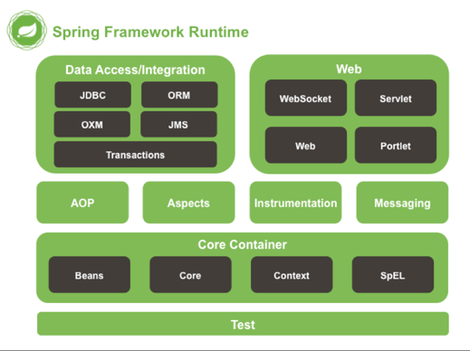
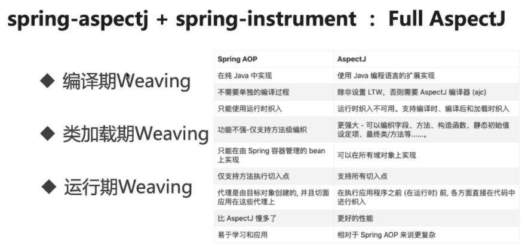

## spring-framework模块介绍（5.0+）

spring发展里程：1.spring-core+spring-data(MVC)-->2.spring boot(微服务)-->3.spring cloud(分布式)-->4.Spring Cloud Data Flow(微服务数据流)

### 1 spring-framework主要模块介绍

    核心模块（core）：spring-core、spring-beans、spring-context、spring-context-support、spring-context-indexer、spring-expression。(前3重要)
    
    切面模块(aop)：spring-aop、spring-aspects+spring-instrument(fullAspectj)。
    
    数据访问/集成(data)：spring-jdbc、spring-tx、spring-orm、spring-oxm、spring-jms。
    
    Web组件：spring-web、spring-webmvc、spring-websocket、spring-webflux。
    
    消息：spring-messaging
    
    测试组件：spring-test

#### 1.1 核心模块（core）

核心模块（core）：spring-core、spring-beans、spring-context、spring-context-support、spring-context-indexer、spring-expression。(前3重要)

    spring-core、spring-beans提供了框架的基础功能，spring-context提供上下文对象状态管理。

|  模板   | 功能  |
|  ----  | ----  |
| spring-core  | 依赖注入IOC与DI的基本实现 |
| spring-beans  | Bean的定义、解析、创建（核心接口Beanfactory） |
| spring-context  | 定义Spring的context上下文，保存对象状态，即IOC容器（扩展Beanfactory，核心接口ApplicationContext） |
| spring-context-support  | 对Spring IOC的扩展支持，以及IOC子容器 |
| spring-context-indexer | Spring的类管理组件和Classpath扫描 |
| spring-expression | Spring表达式语言 |

#### 1.2 切面模块(aop)

切面模块(aop)：spring-aop、spring-aspects+spring-instrument(fullAspectj)。（第一个重要）

|  模板   | 功能  |
|  ----  | ----  |
| spring-aop | 面向切面，JDK动态代理、CGLIB动态代理 |
| spring-aspects  | 集成AspectJ（AOP应用框架） |
| spring-instrument | 动态Class Loading模块，提供了类植入(instrumentation)支持和类加载器的实现|

#### 1.3 数据访问/集成(data)

数据访问/集成(data)：spring-jdbc、spring-tx、spring-orm、spring-oxm、spring-jms。

|  模板   | 功能  |
|  ----  | ----  |
| spring-jdbc | JDBC封装 |
| spring-tx  | JDBC事务实现 |
| spring-orm | 数据库ORM框架集成|
| spring-oxm | java与xml的映射互转 |
| spring-jms | Java Messaging Service能够发送和接受信息|

#### 1.4 Web组件

Web组件：spring-web、spring-webmvc、spring-websocket、spring-webflux。

|  模板   | 功能  |
|  ----  | ----  |
| spring-web | 最基础Web支持，主要建立于核心容器之上,通过Servlet和Listener来初始化IOC容器 |
| spring-webmvc  | springMVC的web应用实现 |
| spring-websocket | 与web前端的全双工通讯协议长连接实现|
| spring-webflux | 一个新的非阻塞函数式Reactive Web框架，可以用来建立异步的，非阻塞，事件驱动的服务|

#### 1.5 消息

消息：spring-messaging

|  模板   | 功能  |
|  ----  | ----  |
| spring-messaging | 集成基础的报文传送应用 |

#### 1.6 测试组件

测试组件：spring-test

    支持使用JUnit或TestNG对Spring组件进行单元测试和 集成测试。

|  模板   | 功能  |
|  ----  | ----  |
| spring-test| 提供测试支持 |

###

    JDK动态代理
    CGLIB动态代理

### 参考

    官网 https://spring.io/projects/spring-framework
 
    源码项目地址：https://github.com/spring-projects/spring-framework

    源码编译参考：https://github.com/spring-projects/spring-framework/wiki/Build-from-Source

    模块介绍：https://lfvepclr.gitbooks.io/spring-framework-5-doc-cn/content/2/2-2.html

    中文文档：https://lfvepclr.gitbooks.io/spring-framework-5-doc-cn/content/2/2.html